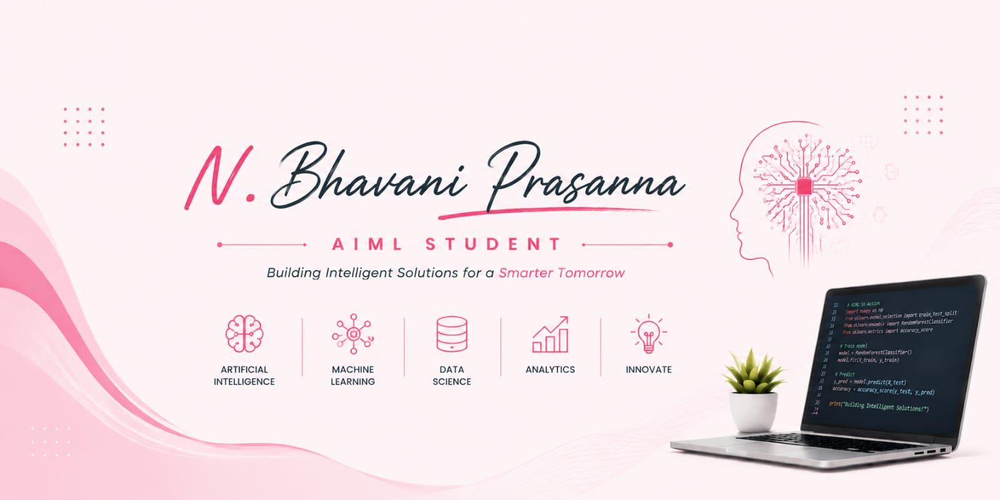

🌐 Portfolio Website:
https://ai-ml-professional-p-n3zk.bolt.host

# Hi, I'm Bhavani Prasanna

## Aspiring AI Engineer | B.Tech AIML Student

# 💫 About Me:
🔭 Building AI-powered solutions using Python, Machine Learning, Deep Learning, and Generative AI  👯 Open to collaborating on AI, ML, and Open Source projects  🌱 Currently learning DSA, Agentic AI, RAG, and Advanced Machine Learning  💬 Ask me about Python, SQL, Machine Learning, Git & GitHub  ⚡ Consistent learner focused on creating impactful AI applications

## 🌐 Socials:
  

# 💻 Tech Stack:
             
# 📊 GitHub Stats:
 
 

